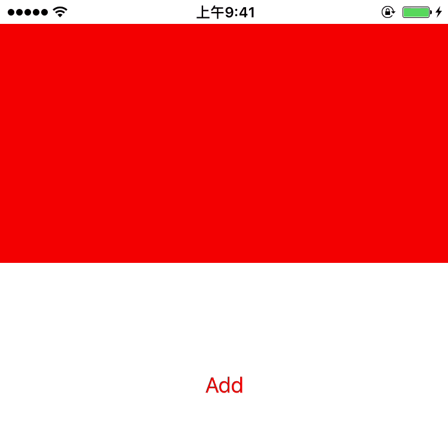

# OVCoinDynamicView
模仿摩拜单车骑行贴纸功能
支持 iOS 9.0 以上设备

## 预览

- 

## 使用方式

1.添加可交互区域的边界view

```objc
dynamicView = [[OVCoinDynamicView alloc] initWithFrame:CGRectMake(0, 20, self.view.frame.size.width, 200)];
dynamicView.backgroundColor = [UIColor redColor];
[dynamicView configureWithNewCoin];
[self.view addSubview:dynamicView];
```

2.添加带图片的coinview

* 使用本地图片

```objc
[dynamicView addCoinWithRadius:20 andImageURL:@"https://avatars0.githubusercontent.com/u/2271569?s=100&v=4"];
```

* 使用远程图片

```objc
[dynamicView addCoinWithRadius:20 andImageName:@"avatar_1.png"];
```

3.停止重力感应的方法
```objc
[dynamicView stopDeviceMotionEffect];
```
